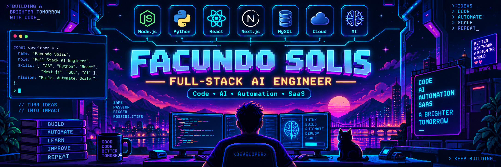
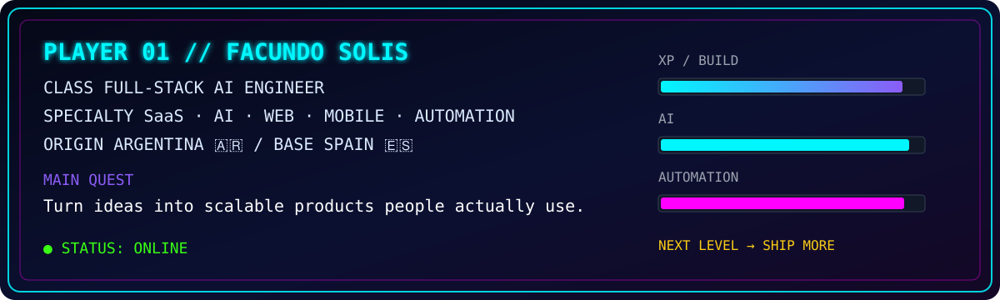
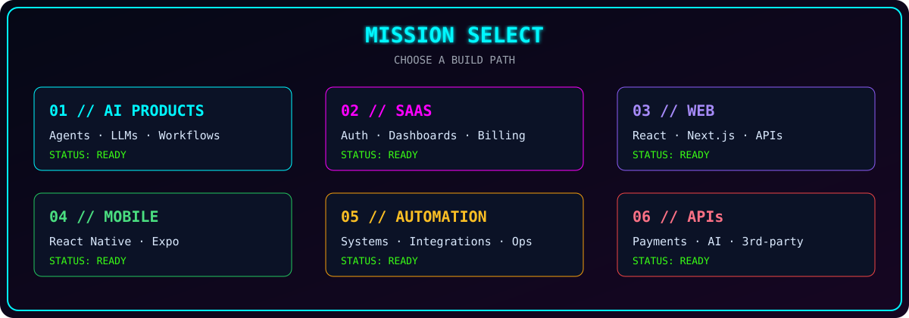
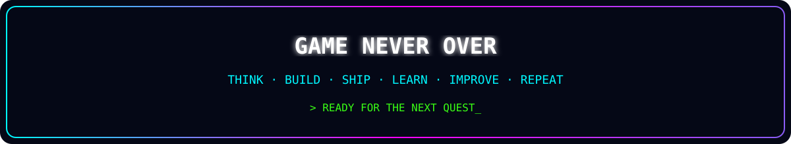

<div align="center">



<br>


<br><br>


</div>

<br>



<div align="center">

### `> PRESS START TO EXPLORE`

</div>

---

## 🕹️ MAIN MENU

```text
╔══════════════════════════════════════════════╗
║                 MAIN MENU                  ║
╠══════════════════════════════════════════════╣
║  [01] PLAYER PROFILE                      ║
║  [02] SKILL TREE                          ║
║  [03] AI LAB                              ║
║  [04] INVENTORY                           ║
║  [05] MISSION SELECT                      ║
║  [06] FEATURED QUESTS                     ║
║  [07] PLAYER STATS                        ║
║  [08] ACHIEVEMENTS                        ║
║  [09] CONNECT                             ║
╚══════════════════════════════════════════════╝
```

---

## ⚡ SYSTEM BOOT SEQUENCE

```text
INITIALIZING PLAYER CORE...
LOADING ENGINE MODULES...
CONNECTING AI LAYER...
SYNCING PRODUCT SYSTEMS...
DEPLOYING CREATIVE STACK...
SYSTEM READY: OPERATIONAL
```

```javascript
const playerOne = {
  name: "Facundo Solis",
  class: "Full-Stack AI Engineer",
  origin: "Argentina 🇦🇷",
  base: "Spain 🇪🇸",
  mission: "Build products people actually use",
  focus: [
    "Artificial Intelligence",
    "SaaS",
    "Automation",
    "Web Applications",
    "Mobile Applications"
  ],
  mentality: "Think → Build → Ship → Learn → Improve"
};
```

I build complete digital products from idea to production.

My work combines software engineering, artificial intelligence, automation and product development. I enjoy owning the full product lifecycle: architecture, frontend, backend, databases, integrations, deployments and iteration.

```text
                  [ IDEA ]
                     │
                     ▼
            [ PRODUCT VISION ]
                     │
          ┌──────────┴──────────┐
          ▼                     ▼
     [ ARCHITECTURE ]       [ RESEARCH ]
          │                     │
     ┌────┴────┐           ┌────┴────┐
     ▼         ▼           ▼         ▼
 [ FRONTEND ] [ BACKEND ] [ AI + OPS ]
     │         │           │
     └────┬────┴───────┬────┘
          ▼               ▼
      [ DATABASE ]    [ DEPLOYMENT ]
          │               │
          └───────┬───────┘
                  ▼
             [ PRODUCTION ] 🚀
```

---

## 🌳 02 // SKILL TREE

<div align="center">

### `FRONTEND // LVL MAX`


`React` · `Next.js` · `TypeScript` · `JavaScript` · `HTML5` · `CSS3` · `Tailwind`

<br>

### `BACKEND // UNLOCKED`


`Node.js` · `Python` · `PHP` · `REST APIs` · `Backend Architecture`

<br>

### `DATABASES // UNLOCKED`


`PostgreSQL` · `MySQL` · `MongoDB` · `Redis`

<br>

### `DEVOPS // UNLOCKED`


`Docker` · `AWS` · `Git` · `GitHub Actions` · `CI/CD` · `Vercel`

</div>

---

## 🤖 03 // AI LAB

```text
╔══════════════════════════ AI MODULES ═══════════════════════════╗
║                                                               ║
║  [✓] LLM integrations                                         ║
║  [✓] AI-powered applications                                  ║
║  [✓] AI agents                                                ║
║  [✓] Intelligent automation                                   ║
║  [✓] Prompt engineering                                       ║
║  [✓] API + tool integration                                   ║
║  [✓] AI-assisted SaaS                                         ║
║  [✓] Intelligent workflows                                    ║
║                                                               ║
║  SYSTEM STATUS ................. OPERATIONAL // STABLE        ║
╚═══════════════════════════════════════════════════════════════════╝
```

<div align="center">


</div>

```python
def turn_idea_into_product(idea):
    architecture = design(idea)
    product = build(
        architecture=architecture,
        frontend=True,
        backend=True,
        ai=True,
        automation=True,
    )
    deploy(product)
    learn_from_users()
    iterate()
    return "REAL WORLD IMPACT 🚀"
```

---

## 🎒 04 // INVENTORY

<table>
<tr>
<td width="33%" valign="top">

### ⚔️ FRONTEND

```text
React
Next.js
TypeScript
JavaScript
Tailwind CSS
HTML5
CSS3
```

</td>
<td width="33%" valign="top">

### 🛡️ BACKEND

```text
Node.js
Python
PHP
REST APIs
Authentication
Integrations
Architecture
```

</td>
<td width="33%" valign="top">

### 🧪 DATA

```text
PostgreSQL
MySQL
MongoDB
Redis
SQL
Caching
Data Modeling
```

</td>
</tr>
<tr>
<td width="33%" valign="top">

### 🧠 AI

```text
LLMs
AI Agents
Automation
Prompt Engineering
AI Workflows
Tool Integration
```

</td>
<td width="33%" valign="top">

### ☁️ DEVOPS

```text
Docker
AWS
CI/CD
GitHub Actions
Vercel
Git
Linux
```

</td>
<td width="33%" valign="top">

### 📱 MOBILE

```text
React Native
Expo
Cross-platform Apps
Mobile APIs
Push Notifications
```

</td>
</tr>
</table>

---

## 🗺️ 05 // MISSION SELECT



<br>

<table>
<tr>
<td width="50%" valign="top">

### 🤖 AI PRODUCTS

`████████████████████ 100%`

AI-powered products, assistants, agents, intelligent workflows and LLM integrations.

</td>
<td width="50%" valign="top">

### 🚀 SAAS PLATFORMS

`████████████████████ 100%`

Complete SaaS products with authentication, dashboards, APIs, subscriptions and infrastructure.

</td>
</tr>
<tr>
<td width="50%" valign="top">

### 🌐 WEB APPLICATIONS

`████████████████████ 100%`

Modern, scalable applications with React, Next.js and a strong backend layer.

</td>
<td width="50%" valign="top">

### 📱 MOBILE APPLICATIONS

`██████████████████░░ 90%`

Cross-platform apps using React Native and Expo, with real product thinking.

</td>
</tr>
<tr>
<td width="50%" valign="top">

### ⚙️ AUTOMATION

`████████████████████ 100%`

Process automation, tool integration and operational workflows with tangible value.

</td>
<td width="50%" valign="top">

### 🔌 API INTEGRATIONS

`████████████████████ 100%`

Payments, AI providers, third-party services and internal systems.

</td>
</tr>
</table>

---

## 🚀 06 // FEATURED QUESTS

### 🏆 QUEST #001 — DUFIT

```text
╔══════════════════════════════════════════════════════════════╗
║  QUEST        DUFIT                                       ║
║  TYPE         SOCIAL FITNESS / MOBILE PRODUCT             ║
║  ROLE         FOUNDER + FULL-STACK DEVELOPER              ║
║  STATUS       LIVE                                        ║
║  OBJECTIVE    HELP PEOPLE FIND TRAINING PARTNERS          ║
╚══════════════════════════════════════════════════════════════╝
```

Dufit helps people find training partners, connect with other athletes and make training more social.

`MATCH` → `CONNECT` → `TRAIN` → `IMPROVE`

<br>

### 🧠 QUEST #002 — AI + SAAS SYSTEMS

```text
AUTHENTICATION       [✓]
USER MANAGEMENT      [✓]
DASHBOARDS           [✓]
AI INTEGRATIONS      [✓]
APIs                 [✓]
AUTOMATION           [✓]
DATABASES            [✓]
CLOUD DEPLOYMENT     [✓]
PRODUCT ITERATION    [✓]
```

I build SaaS ecosystems end-to-end, combining product thinking with full-stack engineering and AI capabilities.

---

## 📊 07 // PLAYER STATS

<div align="center">


<br><br>


</div>

---

## 🏆 08 // ACHIEVEMENTS

```text
╔══════════════════════════ ACHIEVEMENTS ═══════════════════════╗
║                                                               ║
║  🏆 FULL-STACK BUILDER                                        ║
║     Build products from interface to infrastructure           ║
║                                                               ║
║  🧠 AI INTEGRATOR                                             ║
║     Bring AI into real-world products                         ║
║                                                               ║
║  🚀 PRODUCT SHIPPER                                           ║
║     Move from idea and prototype to production                ║
║                                                               ║
║  ⚙️ AUTOMATION ENGINEER                                       ║
║     Replace repetitive work with intelligent systems          ║
║                                                               ║
║  🌍 REMOTE PLAYER                                             ║
║     Build digital products across borders                     ║
║                                                               ║
╚═══════════════════════════════════════════════════════════════╝
```

<div align="center">


</div>

---

## ❤️ PLAYER HEALTH

```text
CODE          ████████████████████ 100%
CURIOSITY     ████████████████████ 100%
AI            ███████████████████░  95%
AUTOMATION    ███████████████████░  95%
PRODUCT       ███████████████████░  95%
COFFEE        ████████████████████  ∞
```

---

## 🧩 CURRENT QUEST

```text
             SOFTWARE ENGINEERING
                      +
            ARTIFICIAL INTELLIGENCE
                      +
                 AUTOMATION
                      +
              PRODUCT THINKING
                      │
                      ▼
             REAL WORLD IMPACT
```

> **Current objective:** build useful products where AI is part of the solution, not just the buzzword.

---

## 📡 09 // CONNECT

<div align="center">

### `MULTIPLAYER MODE // AVAILABLE`

<br>

<a href="https://github.com/FacundoSolis">
  
</a>

<br><br>

```text
┌───────────────────────────────────────────────┐
│                                               │
│  HAVE AN IDEA?                                │
│                                               │
│  > LET'S TURN IT INTO A REAL PRODUCT.         │
│                                               │
│                     [ START QUEST ]           │
│                                               │
└───────────────────────────────────────────────┘
```

<br>


<br><br>



<br>

`while (alive) { learn(); build(); improve(); }`

<br>

**© FACUNDO SOLIS // PLAYER ONE**

</div>
